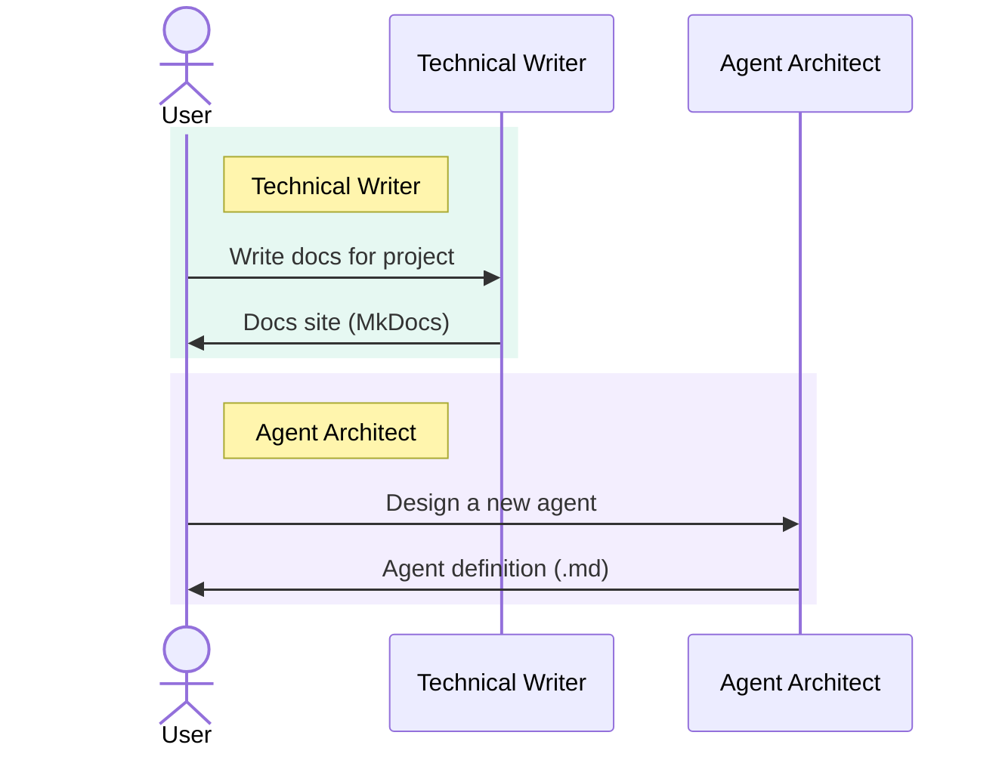
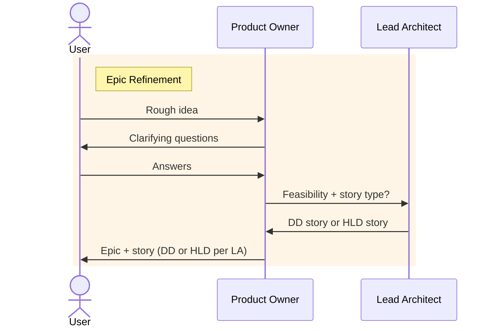
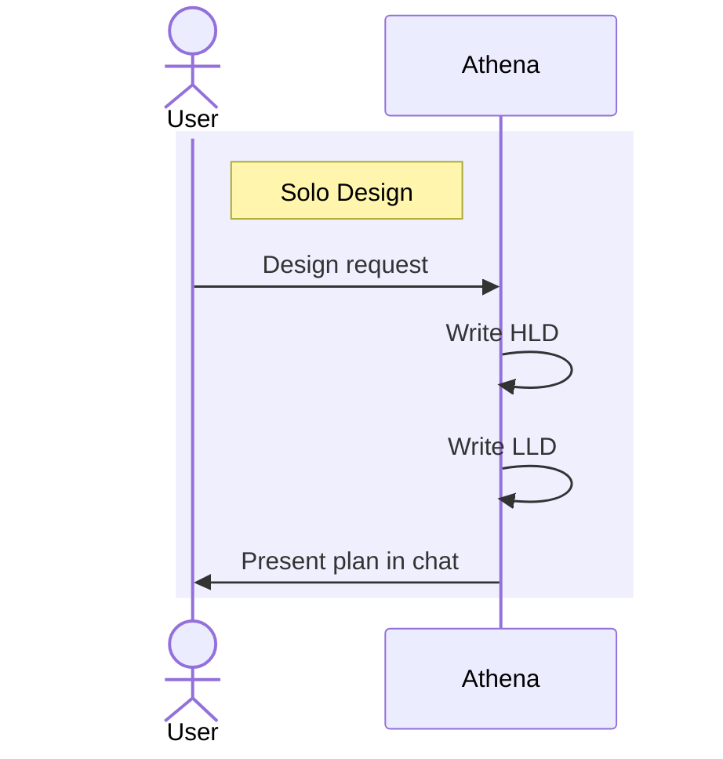
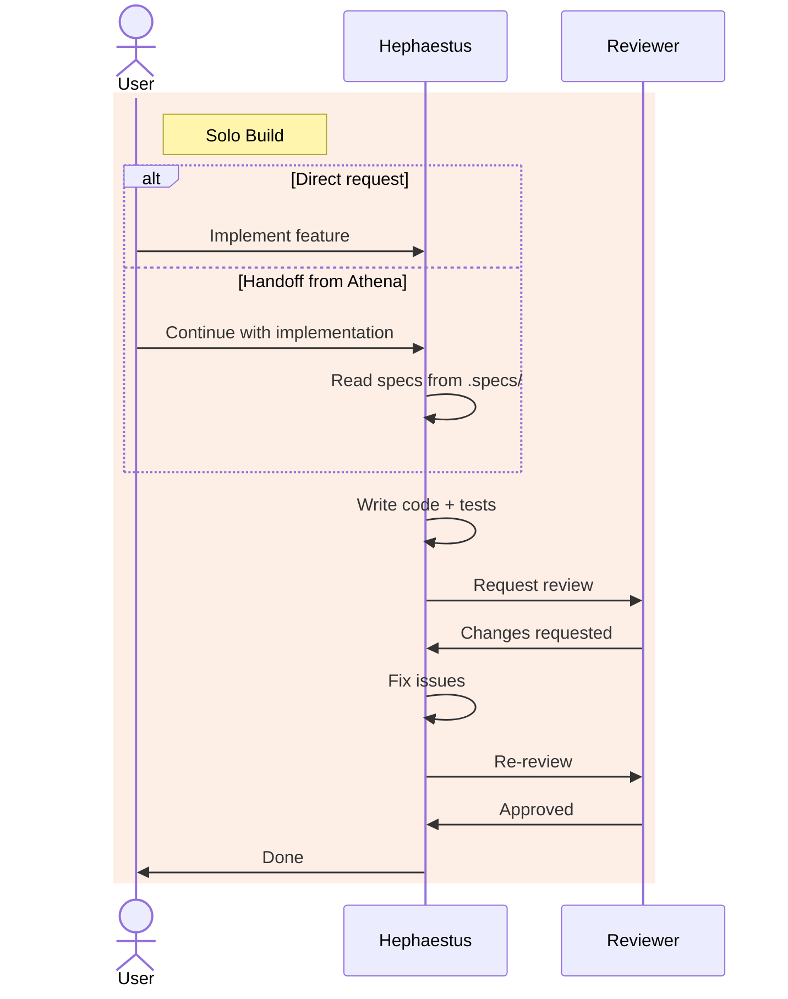
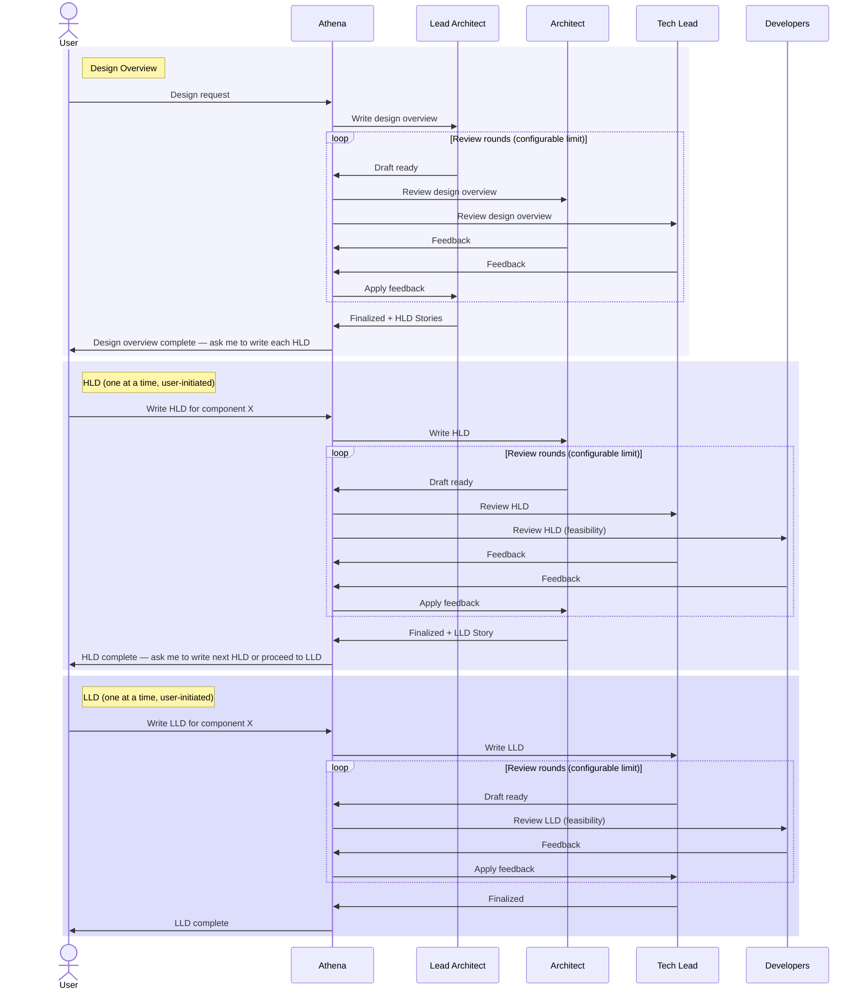
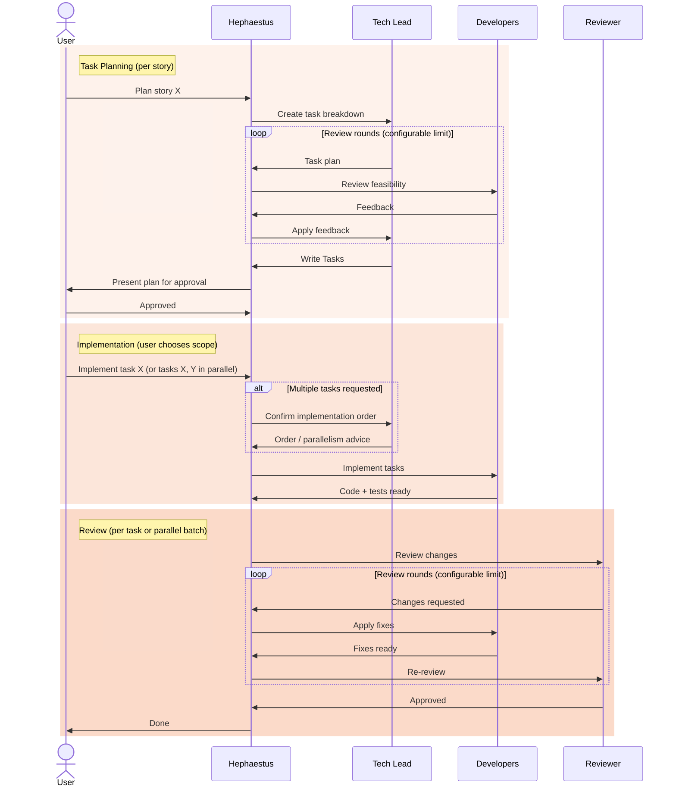

<p align="center">
  
</p>

<h1 align="center">opencode-config</h1>

<p align="center">
  My personal <a href="https://opencode.ai">opencode</a> configuration — a multi-agent AI development team with orchestrated design-to-delivery workflows, domain-specific skills, and curated MCP integrations.
</p>

---

## Table of Contents

- [What's Inside](#whats-inside)
- [Agents](#agents)
  - [Primary Agents](#primary-agents)
  - [Subagents](#subagents)
- [Workflows](#workflows)
  - [Standalone Agents](#standalone-agents)
  - [Product Owner — Epic Refinement](#product-owner--epic-refinement)
  - [Athena — Solo Design](#athena--solo-design)
  - [Hephaestus — Solo Build](#hephaestus--solo-build)
  - [Athena — Team Design](#athena--team-design)
  - [Hephaestus — Team Build](#hephaestus--team-build)
- [Skills](#skills)
  - [Language Skills](#language-skills)
  - [Workflow Skills](#workflow-skills)
- [Commands](#commands)
- [MCP Servers](#mcp-servers)
- [Plugin](#plugin)
- [Setup](#setup)
- [License](#license)

---

## What's Inside

```
.
├── opencode.json        # Main config (MCP servers, plugins)
├── dcp.jsonc            # Dynamic Context Pruning settings
├── agents/              # Agent definitions (role, model, permissions, prompts)
├── commands/            # Slash commands (/design, /implement, /review, …)
└── skills/              # Domain-specific instruction packs
```

Projects that use this config also produce:

```
<project>/
├── .issues/             # Local issue tracking (Epic, Story, Task, Spike)
├── .specs/              # Finalized design documents (HLDs, LLDs, task plans)
└── .ai.tmp/             # Ephemeral AI drafts (compressed notation, disposable)
```

## Agents

### Primary Agents

User-facing agents, switchable with <kbd>Tab</kbd>:

| Agent | Role | Model |
|-------|------|-------|
| **Product Owner** | Refines ideas into structured Epics with stories and acceptance criteria | `claude-sonnet-4.6` |
| **Athena** | Orchestrates architecture design — design overviews, HLDs, LLDs | `claude-sonnet-4.6` |
| **Hephaestus** | Implements features solo or orchestrates a dev team for complex builds | `claude-sonnet-4.6` |
| **Technical Writer** | Generates and maintains MkDocs documentation sites | `claude-sonnet-4.6` |
| **Agent Architect** | Designs, writes, and refines agent/subagent definitions (meta-agent) | `claude-opus-4.6` |

### Subagents

Hidden specialists invoked by orchestrators via the Task tool:

| Agent | Role | Model | Invoked by |
|-------|------|-------|------------|
| **Lead Architect** | Design overviews — system scope, component boundaries | `claude-opus-4.6` | Athena, Product Owner |
| **Architect** | HLDs — what a system does, not how | `claude-sonnet-4.6` | Athena |
| **Tech Lead** | LLDs, task breakdowns, design reviews | `claude-opus-4.6` | Athena, Hephaestus |
| **Developer Backend** | Backend code, APIs, data layers, tests | `claude-sonnet-4.6` | Hephaestus, Athena |
| **Developer Frontend** | Frontend code, UI components, tests | `claude-sonnet-4.6` | Hephaestus, Athena |
| **DevOps** | Infrastructure, CI/CD, deployment configs | `claude-sonnet-4.6` | Hephaestus, Athena |
| **Reviewer** | Code review — quality, security, correctness | `claude-opus-4.6` | Hephaestus |

## Workflows

### Standalone Agents



### Product Owner — Epic Refinement



### Athena — Solo Design



### Hephaestus — Solo Build



### Athena — Team Design



### Hephaestus — Team Build



## Skills

### Language Skills

Loadable instruction packs that teach agents language-specific conventions and best practices:

Bash, C++, Elixir, Go, Java, JavaScript, Lua, Python, Rust, TypeScript, Zig

### Workflow Skills

| Skill | Purpose |
|-------|---------|
| **clean-code** | SOLID principles, design patterns, readability standards |
| **tdd** | Test-Driven Development — Red-Green-Refactor cycle with wire protocol signals |
| **issue-tracking** | Local `.issues/` conventions — file naming, YAML frontmatter, ID management |
| **cvs-mode** | CVS integration — GitHub/GitLab/Forgejo auto-detection, MCP-first with CLI fallback |
| **wire-protocol** | Base communication DSL for subagents — signals, compressed output, no hallucination |
| **wire-design** | Design document extension — compressed notation for reviews and drafts |
| **spec-naming** | Path authority for orchestrators — draft/final naming, directory conventions |
| **mcp-tools** | External MCP tool reference |

## Commands

| Command | Description | Agent |
|---------|-------------|-------|
| `/design` | Start an architecture design session — design overviews, HLDs, LLDs | Athena |
| `/review-design` | Dispatch reviewers to evaluate an existing design document | Athena |
| `/spike` | Conduct a technical research spike — explore, analyze, report | Athena |
| `/implement` | Implement a feature from a spec, issue, or direct instructions | Hephaestus |
| `/fix` | Investigate and fix a bug from a description or issue reference | Hephaestus |
| `/review` | Trigger a code review on specific files or recent changes | Hephaestus |
| `/tdd` | Implement a feature using Test-Driven Development | Hephaestus |
| `/pr` | Create a pull request with auto-generated description | Hephaestus |
| `/refine` | Refine a rough idea into a structured Epic with stories and acceptance criteria | Product Owner |
| `/backlog` | Review and prioritize the backlog — scan issues, suggest next actions | Product Owner |
| `/sync-issues` | Sync issues between CVS platform and local `.issues/` directory | Product Owner |
| `/docs` | Generate or update MkDocs documentation for the current project | Technical Writer |
| `/changelog` | Generate or update CHANGELOG.md from git history and resolved issues | Technical Writer |
| `/new-agent` | Design a new OpenCode agent — discovery, design, prompt crafting | Agent Architect |
| `/refine-agent` | Analyze and refine an existing agent — improve prompt, permissions, design | Agent Architect |
| `/new-skill` | Design a new OpenCode skill — domain-specific instructions for agents | Agent Architect |

## MCP Servers

Pre-configured integrations (enable/disable in `opencode.json`):

| Server | Category | Default |
|--------|----------|---------|
| **Playwright** | Browser automation | Enabled |
| **Puppeteer** | Browser automation | Disabled |
| **Context7** | Documentation lookup | Enabled |
| **GitHub Grep** | Code search across GitHub | Enabled |
| **JSON Memory** | Persistent knowledge graph | Enabled |
| **Sequential Thinking** | Structured reasoning | Enabled |
| **LibSQL Memory** | SQLite-based memory | Disabled |
| **GitHub MCP** | GitHub repos & issues | Disabled |
| **GitLab MCP** | GitLab integration | Disabled |
| **Forgejo MCP** | Forgejo integration | Disabled |
| **CocoIndex** | Code indexing | Disabled |
| **FastCode** | Code indexing | Disabled |
| **Tavily** | Web crawling | Disabled |
| **Firecrawl** | Web crawling | Disabled |

## Plugin

Uses [`@tarquinen/opencode-dcp`](https://www.npmjs.com/package/@tarquinen/opencode-dcp) for Dynamic Context Pruning — automatic context management to keep conversations efficient.

## Setup

1. **Install [opencode](https://opencode.ai)**

2. **Clone this repo** into your opencode config directory:
   ```bash
   git clone git@github.com:dragoscirjan/opencode-config.git ~/.config/opencode
   ```

3. **Install dependencies:**
   ```bash
   cd ~/.config/opencode && bun install
   ```

4. **Set environment variables** for any MCP servers you want to enable:
   ```bash
   # Browser automation
   export BROWSER_PATH="/usr/bin/chromium"

   # Memory (auto-configured per project)
   export PROJECT_PATH="/path/to/your/project"

   # Optional — enable as needed
   export GITHUB_TOKEN="..."
   export TAVILY_API_KEY="..."
   export FIRECRAWL_API_KEY="..."
   ```

5. **Enable/disable MCP servers** by toggling `"enabled"` in `opencode.json`.

## License

[MIT](LICENSE)
