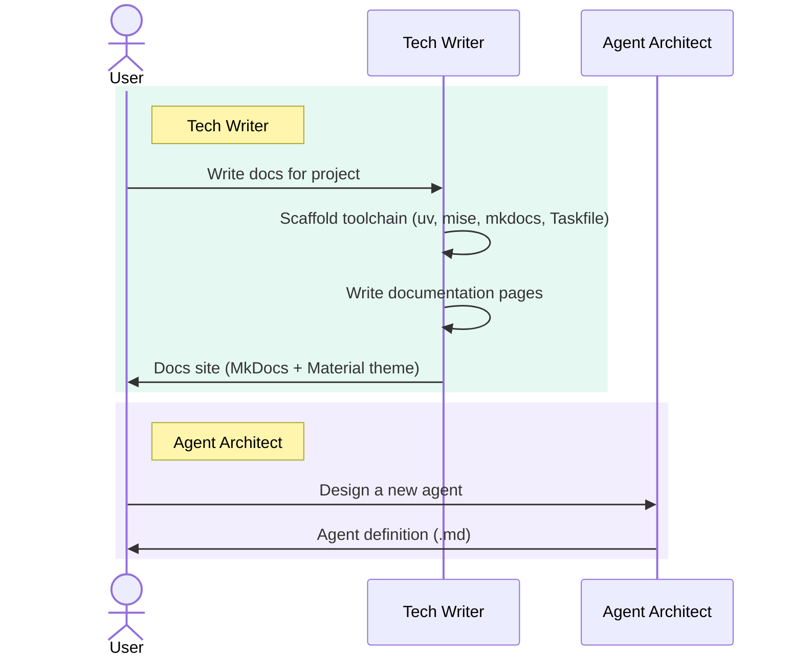
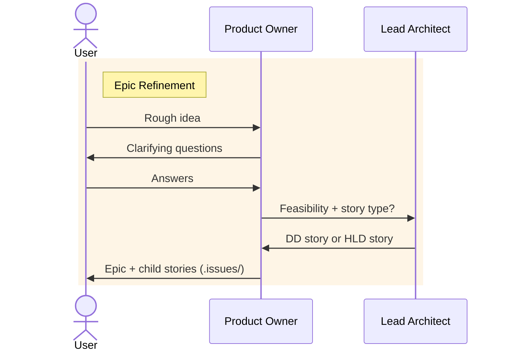
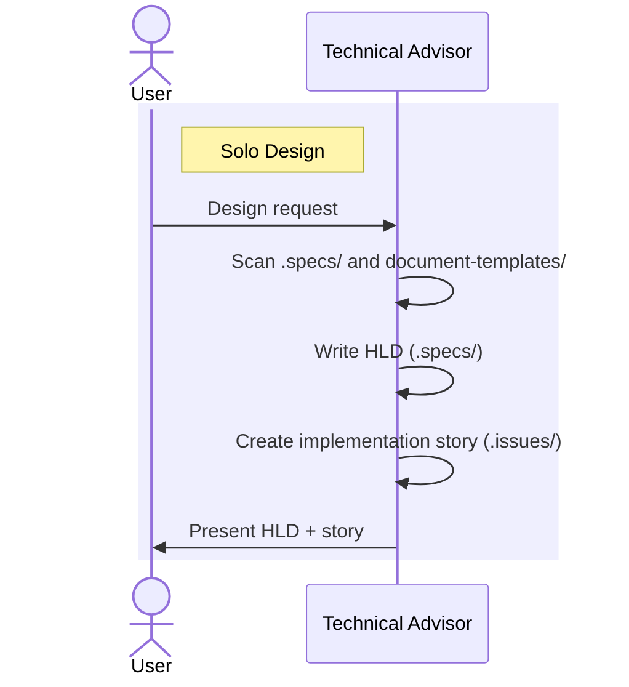
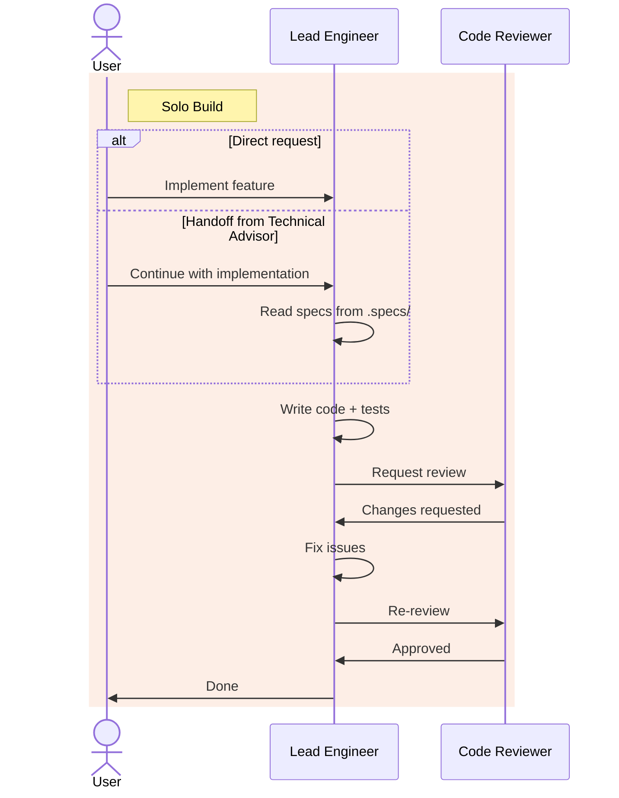
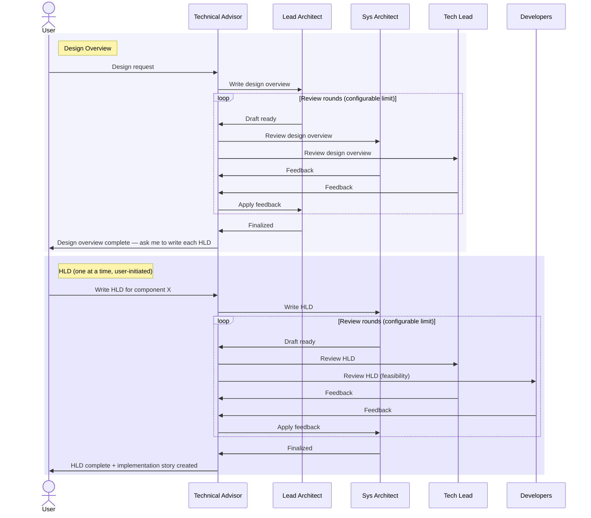
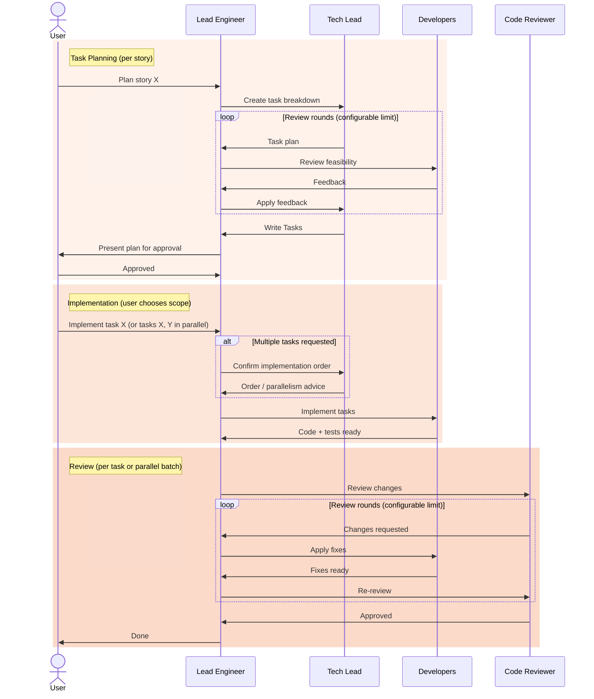

# Software Development with OpenCode

Multi-agent AI development team with orchestrated design-to-delivery workflows. From rough ideas to structured Epics, architecture design, implementation, code review, and documentation — each stage handled by a specialized agent.

---

## Table of Contents

- [Agents](#agents)
  - [Primary Agents](#primary-agents)
  - [Subagents](#subagents)
- [Workflows](#workflows)
  - [Standalone Agents](#standalone-agents)
  - [Product Owner — Epic Refinement](#product-owner--epic-refinement)
  - [Technical Advisor — Solo Design](#technical-advisor--solo-design)
  - [Lead Engineer — Solo Build](#lead-engineer--solo-build)
  - [Technical Advisor — Team Design](#technical-advisor--team-design)
  - [Lead Engineer — Team Build](#lead-engineer--team-build)
- [Skills](#skills)
  - [Developer Skills](#developer-skills)
  - [Workflow Skills](#workflow-skills)
- [Custom Tools](#custom-tools)
- [Commands](#commands)

---

## Agents

### Primary Agents

User-facing agents, switchable with <kbd>Tab</kbd>:

| Agent | Role | Model |
|-------|------|-------|
| **Product Owner** | Refines ideas into structured Epics with stories and acceptance criteria | `claude-sonnet-4.6` |
| **Technical Advisor** | Orchestrates architecture design — design overviews, HLDs, GDDs (via Game Designer for game projects) | `claude-sonnet-4.6` |
| **Lead Engineer** | Implements features solo or orchestrates a dev team for complex builds | `claude-sonnet-4.6` |
| **Technical Writer** | Generates and maintains MkDocs documentation sites | `claude-sonnet-4.6` |
| **Agent Architect** | Designs, writes, and refines agent/subagent definitions (meta-agent) | `claude-opus-4.6` |

### Subagents

Hidden specialists invoked by orchestrators via the Task tool:

| Agent | Role | Model | Invoked by |
|-------|------|-------|------------|
| **Lead Architect** | Design overviews — system scope, component boundaries | `claude-opus-4.6` | Tech Advisor, Product Owner |
| **Sys Architect** | HLDs — what a system does, not how | `claude-sonnet-4.6` | Tech Advisor |
| **Tech Lead** | LLDs, task breakdowns, design reviews | `claude-opus-4.6` | Tech Advisor, Lead Engineer |
| **Backend Dev** | Backend code, APIs, data layers, tests | `claude-sonnet-4.6` | Lead Engineer |
| **Frontend Dev** | Frontend code, UI components, tests | `claude-sonnet-4.6` | Lead Engineer |
| **Devops** | Infrastructure, CI/CD, deployment configs | `claude-sonnet-4.6` | Lead Engineer |
| **Code Reviewer** | Code review — quality, security, correctness | `claude-opus-4.6` | Lead Engineer |

All agents operate in two modes:

- **Solo mode** (default) — the primary agent does all work itself
- **Team mode** (`iterations=N`) — the primary agent delegates to subagents with iterative review rounds

## Workflows

### Standalone Agents

### Product Owner — Epic Refinement

### Technical Advisor — Solo Design

> For game projects, the Technical Advisor dispatches to the **Game Designer** subagent instead of writing an HLD herself. See [Game Development](README_GAME_DEV.md#workflow) for that workflow.

### Lead Engineer — Solo Build

### Technical Advisor — Team Design

### Lead Engineer — Team Build

## Skills

### Developer Skills

| Skill | Scope |
|-------|-------|
| **developer-backend** | C/C++, C#, Java, Go, Python, Rust, Zig, Elixir, Lua, Swift, JS/TS, Shell/Bash, Fish, PowerShell, Markdown, YAML, JSON |
| **developer-frontend** | HTML/CSS, JavaScript, TypeScript, Angular, React, Vue, Svelte |
| **developer-devops** | Ansible, Terraform, OpenTofu, Shell/Bash, PowerShell, Fish |

### Workflow Skills

| Skill | Purpose |
|-------|---------|
| **clean-code** | SOLID principles, design patterns, readability standards, quality tooling (.editorconfig, jscpd, Semgrep, MegaLinter, pre-commit, commitlint) |
| **tdd** | Test-Driven Development — Red-Green-Refactor cycle |
| **issue-tracking** | Local `.issues/` conventions — file naming, YAML frontmatter, ID management |
| **issue-tracking-cvs** | CVS-backed issue tracking — same conventions via GitHub/GitLab/Forgejo API |
| **cvs-mode** | CVS integration — GitHub/GitLab/Forgejo auto-detection, MCP-first with CLI fallback |
| **mcp-tools** | External MCP tool reference — memory, docs, browser, code indexing, CVS, web crawl |

## Custom Tools

TypeScript tools extending agent capabilities (built with `@opencode-ai/plugin`):

| Tool | Purpose |
|------|---------|
| **spec-create** | Creates `.specs/<type>-<id>-<slug>-v<ver>.md` with auto-incrementing ID and versioning. Types: `hld`, `lld`, `task`. |
| **issue-create** | Creates `.issues/<id>-<type>-<slug>.md` with auto-incrementing ID. Types: `epic`, `story`, `task`, `spike`. |
| **draft-create** | Creates `.ai.tmp/<slug>-<hash>.md` for ephemeral working drafts. |

## Commands

| Command | Description | Agent |
|---------|-------------|-------|
| `/design` | Start an architecture design session — design overviews, HLDs | Technical Advisor |
| `/review-design` | Dispatch reviewers to evaluate an existing design document | Technical Advisor |
| `/spike` | Conduct a technical research spike — explore, analyze, report | Technical Advisor |
| `/implement` | Implement a feature from a spec, issue, or direct instructions | Lead Engineer |
| `/fix` | Investigate and fix a bug from a description or issue reference | Lead Engineer |
| `/review` | Trigger a code review on specific files or recent changes | Lead Engineer |
| `/tdd` | Implement a feature using Test-Driven Development | Lead Engineer |
| `/pr` | Create a pull request with auto-generated description | Lead Engineer |
| `/refine` | Refine a rough idea into a structured Epic with stories and acceptance criteria | Product Owner |
| `/backlog` | Review and prioritize the backlog — scan issues, suggest next actions | Product Owner |
| `/sync-issues` | Sync issues between CVS platform and local `.issues/` directory | Product Owner |
| `/docs` | Generate or update MkDocs documentation for the current project | Technical Writer |
| `/changelog` | Generate or update CHANGELOG.md from git history and resolved issues | Technical Writer |
| `/new-agent` | Design a new OpenCode agent — discovery, design, prompt crafting | Agent Architect |
| `/refine-agent` | Analyze and refine an existing agent — improve prompt, permissions, design | Agent Architect |
| `/new-skill` | Design a new OpenCode skill — domain-specific instructions for agents | Agent Architect |
