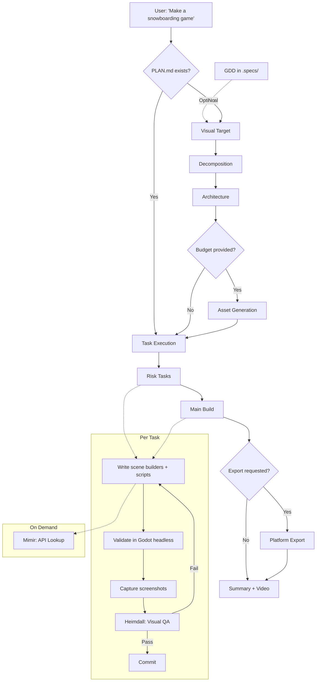

# Game Development with OpenCode

AI-powered game development pipeline that turns a sentence into a playable [Godot 4](https://godotengine.org/) project. Describe what you want, and an autonomous pipeline designs the architecture, generates art, writes every line of code, captures screenshots from the running engine, and fixes what doesn't look right.

Inspired by [Godogen](https://github.com/AexLiworworthy/godogen) (Claude Code skills for Godot game generation), rebuilt from scratch for [OpenCode](https://opencode.ai) with native TypeScript tooling, cross-platform support, and multi-target export.

---

## Table of Contents

- [How It Works](#how-it-works)
- [Workflow](#workflow)
- [Agents](#agents)
  - [Freya — Game Designer](#freya--game-designer)
  - [Odin — Orchestrator](#odin--orchestrator)
  - [Mimir — Godot API Lookup](#mimir--godot-api-lookup)
  - [Heimdall — Visual QA](#heimdall--visual-qa)
- [Pipeline](#pipeline)
- [Skills](#skills)
- [Tools](#tools)
- [Commands](#commands)
- [Platform Support](#platform-support)
  - [Development Hosts](#development-hosts)
  - [Export Targets](#export-targets)
- [Prerequisites](#prerequisites)
- [Getting Started](#getting-started)
- [Architecture Decisions](#architecture-decisions)

---

## How It Works

- **Unified workflow** — game ideas flow through the same front door as software: Hermes (Product Owner) refines the idea into an Epic, Athena (Technical Advisor) orchestrates a Game Design Document via Freya (Game Designer), then Odin (Game Generator) builds the game from the GDD. You can also go directly to Odin for quick builds.
- **Four game-specific agents** — Freya writes GDDs (what the game does), Odin builds it (visual target through delivery), Mimir handles Godot API lookup, Heimdall does visual QA. All in isolated contexts.
- **Godot 4 output** — real projects with proper scene trees, scripts, and asset organization. Handles 2D and 3D.
- **Asset generation** — Gemini creates precise references and characters; xAI Grok handles textures, simple objects, and animated sprites via video generation; Tripo3D converts images to 3D models. Budget-aware: maximizes visual impact per cent spent.
- **GDScript expertise** — custom-built language reference and lazy-loaded API docs for all 850+ Godot classes compensate for LLMs' thin training data on GDScript.
- **Visual QA closes the loop** — captures actual screenshots from the running game and analyzes them with Gemini Flash and Claude vision. Catches z-fighting, missing textures, broken physics, and implementation shortcuts.
- **All TypeScript** — every tool is native TypeScript using `@opencode-ai/plugin`. No Python dependency. System requirements: Node.js, Godot, ffmpeg.
- **Cross-platform** — develops on Windows, macOS, and Linux. Exports to all five platforms including Android and iOS.

## Workflow

The game development workflow mirrors the software development workflow:

```
Software:  Hermes (Epic) → Athena → Architect (HLD)  → Hephaestus (build)
Game:      Hermes (Epic) → Athena → Freya (GDD)      → Odin (build)
```


**Quick mode:** Skip Hermes and Athena — go directly to Odin with `/godogen`. Odin handles planning internally.

## Agents

### Freya — Game Designer

**Subagent** (`minion-freya-game-designer`). The Goddess of Love and Fertility — nurtures raw ideas into complete game designs. Writes Game Design Documents that describe WHAT a game does: mechanics, art direction, controls, player experience, scope, and asset requirements.

| Setting | Value | Rationale |
|---|---|---|
| Model | `claude-sonnet-4.6` | Creative writing + structured design |
| Temperature | 0.4 | Balanced — creative for vision, structured for mechanics |
| Hidden | true | Invoked by Athena during the design workflow |

Freya does NOT write code, GDScript, or engine internals. She describes the game — Odin translates it into a Godot project. Loads the `game-design` skill and follows the GDD template at `document-templates/gdd.md`. Challenges vague mechanics, flags missing win/lose conditions, and pushes for specificity.

### Odin — Orchestrator

**Primary agent.** The All-Father. Runs the full pipeline from concept (or GDD) to playable build: visual target, risk decomposition, architecture, asset generation, task execution, visual QA, and delivery. Produces complete Godot 4 projects from natural language or from a Game Design Document in `.specs/`.

| Setting | Value | Rationale |
|---|---|---|
| Model | `claude-opus-4.6` | Architecture, game design, multi-stage reasoning, GDScript generation |
| Temperature | 0.3 | Creative for game design, precise for code |
| Steps | 100 | Multi-hour pipeline runs |

Loads skills progressively — one per pipeline stage. Delegates API lookup to Mimir and visual QA to Heimdall. Manages the document protocol (`PLAN.md`, `STRUCTURE.md`, `ASSETS.md`, `MEMORY.md`) for crash-safe resumability.

### Mimir — Godot API Lookup

**Subagent** (`minion-mimir-godot-api`). Guardian of the Well of Knowledge. Keeps 850+ class API docs out of Odin's context window.

| Setting | Value | Rationale |
|---|---|---|
| Model | `claude-sonnet-4.6` | Lookup and synthesis |
| Temperature | 0.1 | Precise retrieval |
| Hidden | true | Invoked only by Odin |

Two-tier lazy loading: `_common.md` (~128 frequent classes) then `_other.md` (~730 remaining), then `{ClassName}.md` for the specific class. Also answers GDScript syntax questions.

### Heimdall — Visual QA

**Subagent** (`minion-heimdall-visual-qa`). The Watchman who sees all. Analyzes screenshots for defects, compares against reference images, evaluates motion in frame sequences.

| Setting | Value | Rationale |
|---|---|---|
| Model | `claude-sonnet-4.6` | Vision analysis |
| Temperature | 0.2 | Analytical |
| Hidden | true | Invoked only by Odin |

Three modes:
- **Static** — one screenshot vs reference image (scenes without motion)
- **Dynamic** — frame sequence at 2 FPS cadence (motion, physics, animation)
- **Question** — free-form visual debugging ("Are surfaces showing magenta?")

Backends: Gemini Flash (default), native Claude vision, or both with aggregated verdict.

## Pipeline



**Stages:**

1. **Visual Target** — generates a reference screenshot (`reference.png`) defining the art direction. Anchors every downstream decision.
2. **Decomposition** — risk-first analysis. Isolates genuinely hard problems (procedural generation, custom physics, shaders) for separate verification. Routine features build together. Output: `PLAN.md`.
3. **Architecture** — scene hierarchy, script responsibilities, signal flow, physics layers, input mapping. Produces a compilable Godot skeleton. Output: `STRUCTURE.md`.
4. **Asset Generation** — budget-aware dual-backend system. Gemini (5-15c) for precise work, xAI Grok (2c) for textures and video, Tripo3D (37c) for 3D models. Animated sprites via video generation with loop detection.
5. **Task Execution** — inline in Odin's context. Risk tasks first (isolated verification), then main build. Generates scene builders (headless .tscn construction) and runtime scripts (game logic). Each task: write, validate, capture, QA.
6. **Visual QA** — Heimdall analyzes screenshots against references. Catches z-fighting, missing textures, broken physics, placeholder remnants, implementation shortcuts.
7. **Platform Export** — builds for requested target platforms (Android APK, iOS IPA, Windows EXE, macOS APP, Linux binary).

## Skills

Loaded progressively by Odin — one per pipeline stage, keeping the context window focused.

| Skill | Contents | When Loaded |
|---|---|---|
| **godot-gdscript** | GDScript language reference, type system, patterns, idioms | By Mimir on every query |
| **godot-engine** | Engine quirks, scene builder patterns, OS-aware capture commands | Before writing code |
| **game-design** | Visual target methodology, risk-first decomposition, architecture scaffolding | Planning stages |
| **game-assets** | Budget optimization, dual-backend image gen, background removal, animated sprites | Asset generation |
| **game-execution** | Task workflow, test harness patterns, visual QA integration | Task execution |
| **platform-export** | Per-platform export: prerequisites, templates, signing, build commands | When user requests export |
| **game-bootstrap** | Cross-platform setup verification, dependency detection, install instructions | First pipeline run |

## Tools

All native TypeScript using `@opencode-ai/plugin`. No Python. No ImageMagick.

| Tool | Purpose | Key Dependencies |
|---|---|---|
| **godot-asset-gen** | Image generation — Gemini (text-to-image, image-to-image) + xAI Grok (images, video) | `@google/genai` |
| **godot-visual-qa** | Gemini Flash screenshot analysis with structured verdicts | `@google/genai` |
| **godot-rembg** | Background removal — BiRefNet segmentation + alpha matting | `@imgly/background-removal`, `sharp` |
| **godot-tripo3d** | Image-to-3D model conversion via Tripo3D API | *(fetch only)* |
| **godot-grid-slice** | Sprite sheet slicing into individual frames | `sharp` |
| **godot-loop-detect** | Animated sprite loop frame detection from video | `sharp`, `fluent-ffmpeg` |
| **godot-api-docs** | Bootstrap 850+ Godot class API docs from engine XML source | `simple-git`, `fast-xml-parser` |

## Commands

| Command | Description | Agent |
|---|---|---|
| `/godogen` | Generate or update a Godot game from a natural language description | Odin |

## Platform Support

### Development Hosts

The pipeline runs on all three desktop platforms:

| Host | Package Manager | GPU Detection | Godot Binary |
|---|---|---|---|
| **Linux** | apt / dnf | `glxinfo` | `godot` |
| **macOS** | brew | `system_profiler` | `godot` or Godot.app symlink |
| **Windows** | winget / choco / scoop | `wmic` | `godot.exe` |

### Export Targets

Games can be exported to all five platforms:

| Target | Requirements | Notes |
|---|---|---|
| **Linux** | Export templates | Straightforward |
| **Windows** | Export templates | Straightforward |
| **macOS** | Export templates, optional notarization | Needs Apple Developer account for distribution |
| **Android** | OpenJDK 17, Android SDK, debug keystore, export templates | ETC2/ASTC texture compression |
| **iOS** | Xcode, Apple Developer account, provisioning profiles | macOS-only host required |

## Prerequisites

Three system dependencies:

| Dependency | Purpose | Install |
|---|---|---|
| **Node.js** (18+) | OpenCode runtime, all tools | [nodejs.org](https://nodejs.org) |
| **Godot 4** | Game engine (headless or editor) | [godotengine.org](https://godotengine.org/download/) |
| **ffmpeg** | Video conversion, frame extraction | `apt install ffmpeg` / `brew install ffmpeg` / `winget install ffmpeg` |

API keys as environment variables:

| Key | Service | Used For |
|---|---|---|
| `GOOGLE_API_KEY` | [Google AI Studio](https://aistudio.google.com/) | Gemini image generation + visual QA |
| `XAI_API_KEY` | [xAI Grok](https://console.x.ai/) | Image/video generation (textures, animated sprites) |
| `TRIPO3D_API_KEY` | [Tripo3D](https://platform.tripo3d.ai/) | Image-to-3D conversion (3D games only) |

## Getting Started

### 1. Install tools

```bash
bun install   # from the opencode config directory
```

### 2. Create a game project

```bash
npx godogen-publish ~/my-game
npx godogen-publish --force ~/my-game   # clean existing target
```

This creates the target directory with `.opencode/agents/`, `.opencode/skills/`, `.opencode/tools/`, `.opencode/commands/`, and an `AGENTS.md`. Initializes a git repo.

### 3. Build a game

Open OpenCode in the game folder, switch to **Odin** (<kbd>Tab</kbd>), and describe what you want:

```
/godogen A top-down racing game with a topographic map aesthetic, contour lines,
and terrain ramps that launch the car into the air.
```

Odin runs the full pipeline autonomously. Progress updates go to your connected channel (Telegram, Slack) if configured.

### 4. Export (optional)

```
/godogen Export to Android APK and Windows EXE
```

## Architecture Decisions

**Why rewrite Python tools in TypeScript?**
Eliminates Python, pip, CUDA, and ImageMagick as dependencies. The entire toolchain runs on Node.js + Godot + ffmpeg — three dependencies that install in minutes on any OS. The `@imgly/background-removal` package replaces the heaviest Python dependency (rembg + onnxruntime-gpu) with a pure-JS ONNX runtime.

**Why three agents instead of one?**
Godot's API documentation for 850+ classes is too large for a single context window. Mimir isolates API lookup in a separate context. Heimdall isolates visual QA (which involves reading multiple large image files) from the main pipeline. Odin keeps its context focused on reasoning and code generation.

**Why progressive skill loading?**
Loading all domain knowledge at once would consume the context window before any work begins. Each skill loads only when its pipeline stage starts — game-design during planning, godot-engine during implementation, platform-export only when the user requests a build. This mirrors the original Godogen architecture but uses OpenCode's native skill system.

**Why risk-first decomposition?**
Most game features are routine (movement, UI, cameras). Every task boundary is an integration risk. The decomposer isolates only genuinely hard problems (procedural generation, custom physics, complex shaders) for separate verification. Everything else builds in one pass, reducing integration bugs.

**Why a document protocol?**
`PLAN.md`, `STRUCTURE.md`, `ASSETS.md`, and `MEMORY.md` survive context compaction. When the context window approaches its limit and earlier messages compress, these files preserve the full pipeline state. The pipeline can resume from any point by reading them.

**Why a Game Design Document?**
Without a GDD, Odin must invent game mechanics, art direction, controls, and scope on the fly — conflating design decisions with engine implementation. Freya writes the GDD first, capturing WHAT the game does in plain English. Odin then translates a stable design into a Godot project. This mirrors the software path (Architect writes HLD → Hephaestus implements) and means non-technical stakeholders can review the game design before any code is written. For quick builds, `/godogen` skips the GDD and lets Odin handle everything inline.
