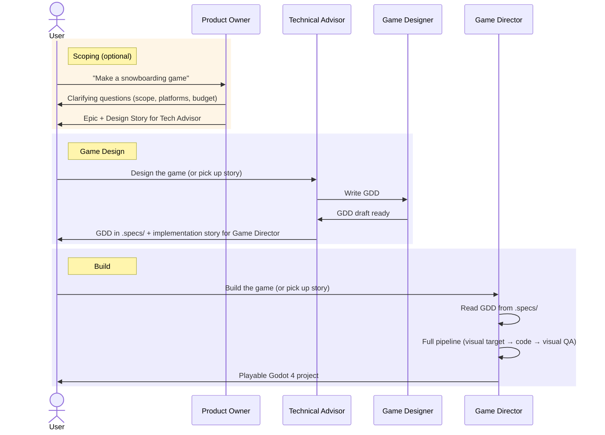
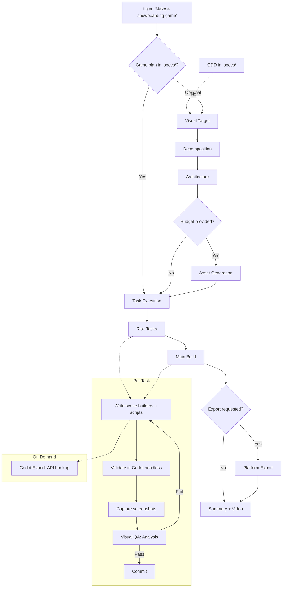

# Game Development with OpenCode

AI-powered game development pipeline that turns a sentence into a playable [Godot 4](https://godotengine.org/) project. Describe what you want, and an autonomous pipeline designs the architecture, generates art, writes every line of code, captures screenshots from the running engine, and fixes what doesn't look right.

Inspired by [Godogen](https://github.com/AexLiworworthy/godogen) (Claude Code skills for Godot game generation), rebuilt from scratch for [OpenCode](https://opencode.ai) with native TypeScript tooling, cross-platform support, and multi-target export.

---

## Table of Contents

- [How It Works](#how-it-works)
- [Workflow](#workflow)
- [Agents](#agents)
  - [Game Designer](#game-designer)
  - [Game Director — Orchestrator](#game-director--orchestrator)
  - [Godot Expert — API Lookup](#godot-expert--api-lookup)
  - [Visual QA](#visual-qa)
- [Pipeline](#pipeline)
- [Skills](#skills)
- [Tools](#tools)
  - [Godot MCP Servers (opt-in)](#godot-mcp-servers-opt-in)
- [Commands](#commands)
- [Platform Support](#platform-support)
  - [Development Hosts](#development-hosts)
  - [Export Targets](#export-targets)
- [Setup](#setup)
  - [Step 1: Install OpenCode](#step-1-install-opencode)
  - [Step 2: Clone this config](#step-2-clone-this-config)
  - [Step 3: Install Node.js dependencies](#step-3-install-nodejs-dependencies)
  - [Step 4: Install system dependencies](#step-4-install-system-dependencies)
  - [Step 5: Configure AI API keys](#step-5-configure-ai-api-keys)
  - [Step 6: Agents — what's involved](#step-6-agents--whats-involved)
  - [Step 7: Enable Godot MCP servers (optional)](#step-7-enable-godot-mcp-servers-optional)
  - [Step 8: Build your first game](#step-8-build-your-first-game)
  - [Step 9: Export to platforms (optional)](#step-9-export-to-platforms-optional)
- [Troubleshooting](#troubleshooting)
- [Architecture Decisions](#architecture-decisions)

---

## How It Works

- **Unified workflow** — game ideas flow through the same front door as software: Product Owner refines the idea into an Epic, Technical Advisor orchestrates a Game Design Document via Game Designer, then Game Director builds the game from the GDD. You can also go directly to Game Director for quick builds.
- **Four game-specific agents** — Game Designer writes GDDs (what the game does), Game Director builds it (visual target through delivery), Godot Expert handles Godot API lookup, Visual QA does visual QA. All in isolated contexts.
- **Godot 4 output** — real projects with proper scene trees, scripts, and asset organization. Handles 2D and 3D.
- **Asset generation** — Gemini creates precise references and characters; xAI Grok handles textures, simple objects, and animated sprites via video generation; Tripo3D converts images to 3D models. Budget-aware: maximizes visual impact per cent spent.
- **GDScript expertise** — custom-built language reference and lazy-loaded API docs for all 850+ Godot classes compensate for LLMs' thin training data on GDScript.
- **Visual QA closes the loop** — captures actual screenshots from the running game and analyzes them with Gemini Flash and Claude vision. Catches z-fighting, missing textures, broken physics, and implementation shortcuts.
- **All TypeScript** — every tool is native TypeScript using `@opencode-ai/plugin`. No Python dependency. System requirements: Node.js, Godot, ffmpeg.
- **Cross-platform** — develops on Windows, macOS, and Linux. Exports to all five platforms including Android and iOS.

## Workflow

The game development workflow mirrors the software development workflow:

```
Software:  Product Owner (Epic) → Tech Advisor → Sys Architect (HLD)  → Lead Engineer (build)
Game:      Product Owner (Epic) → Tech Advisor → Game Designer (GDD)  → Game Director (build)
```



**Quick mode:** Skip Product Owner and Tech Advisor — go directly to Game Director with `/godogen`. Game Director handles planning internally.

## Agents

### Game Designer

**Subagent** (`worker-game-designer`). Nurtures raw ideas into complete game designs. Writes Game Design Documents that describe WHAT a game does: mechanics, art direction, controls, player experience, scope, and asset requirements.

| Setting | Value | Rationale |
|---|---|---|
| Model | `claude-sonnet-4.6` | Creative writing + structured design |
| Temperature | 0.4 | Balanced — creative for vision, structured for mechanics |
| Hidden | true | Invoked by Tech Advisor during the design workflow |

Game Designer does NOT write code, GDScript, or engine internals. She describes the game — Game Director translates it into a Godot project. Loads the `game-design` skill and follows the GDD template at `document-templates/gdd.md`. Challenges vague mechanics, flags missing win/lose conditions, and pushes for specificity.

### Game Director — Orchestrator

**Primary agent.** Runs the full pipeline from concept (or GDD) to playable build: visual target, risk decomposition, architecture, asset generation, task execution, visual QA, and delivery. Produces complete Godot 4 projects from natural language or from a Game Design Document in `.specs/`.

| Setting | Value | Rationale |
|---|---|---|
| Model | `claude-opus-4.6` | Architecture, game design, multi-stage reasoning, GDScript generation |
| Temperature | 0.3 | Creative for game design, precise for code |
| Steps | 100 | Multi-hour pipeline runs |

Loads skills progressively — one per pipeline stage. Delegates API lookup to Godot Expert and visual QA to Visual QA. Uses `.specs/` for game plans (via `spec-create`), `.ai.tmp/` drafts for ephemeral working docs, and the knowledge graph (`memory` tools) for discoveries and quirks — all standard OpenCode document protocol.

When the game requires work beyond GDScript, Game Director delegates to **shared software subagents**:

| Agent | When Game Director uses them |
|-------|------------------------------|
| **Backend Dev** | C/C++/Rust/C# GDExtension modules, native plugins, server-side game logic |
| **Frontend Dev** | Web-based launcher, HTML5 export UI, companion web app |
| **Devops** | CI/CD pipelines, automated builds, export workflows, itch.io/Steam deployment |
| **Tech Lead** | Complex architecture trade-offs (ECS vs scene-tree, networking), LLD review |
| **Code Reviewer** | Code review for GDExtension modules, large refactors, pre-release quality gates |

Game Director writes all GDScript himself — shared subagents handle non-GDScript languages and infrastructure only.

### Godot Expert — API Lookup

**Subagent** (`worker-godot-expert`). Keeps 850+ class API docs out of Game Director's context window.

| Setting | Value | Rationale |
|---|---|---|
| Model | `claude-sonnet-4.6` | Lookup and synthesis |
| Temperature | 0.1 | Precise retrieval |
| Hidden | true | Invoked only by Game Director |

Two-tier lazy loading: `_common.md` (~128 frequent classes) then `_other.md` (~730 remaining), then `{ClassName}.md` for the specific class. Also answers GDScript syntax questions.

### Visual QA

**Subagent** (`worker-visual-qa`). Analyzes screenshots for defects, compares against reference images, evaluates motion in frame sequences.

| Setting | Value | Rationale |
|---|---|---|
| Model | `claude-sonnet-4.6` | Vision analysis |
| Temperature | 0.2 | Analytical |
| Hidden | true | Invoked only by Game Director |

Three modes:
- **Static** — one screenshot vs reference image (scenes without motion)
- **Dynamic** — frame sequence at 2 FPS cadence (motion, physics, animation)
- **Question** — free-form visual debugging ("Are surfaces showing magenta?")

Backends: Gemini Flash (default), native Claude vision, or both with aggregated verdict.

## Pipeline



**Stages:**

1. **Visual Target** — generates a reference screenshot (`reference.png`) defining the art direction. Anchors every downstream decision.
2. **Decomposition** — risk-first analysis. Isolates genuinely hard problems (procedural generation, custom physics, shaders) for separate verification. Routine features build together. Output: game plan spec in `.specs/`.
3. **Architecture** — scene hierarchy, script responsibilities, signal flow, physics layers, input mapping. Produces a compilable Godot skeleton. Output: architecture notes in `.ai.tmp/`.
4. **Asset Generation** — budget-aware dual-backend system. Gemini (5-15c) for precise work, xAI Grok (2c) for textures and video, Tripo3D (37c) for 3D models. Animated sprites via video generation with loop detection.
5. **Task Execution** — inline in Game Director's context. Risk tasks first (isolated verification), then main build. Generates scene builders (headless .tscn construction) and runtime scripts (game logic). Each task: write, validate, capture, QA.
6. **Visual QA** — Visual QA analyzes screenshots against references. Catches z-fighting, missing textures, broken physics, placeholder remnants, implementation shortcuts.
7. **Platform Export** — builds for requested target platforms (Android APK, iOS IPA, Windows EXE, macOS APP, Linux binary).

## Skills

Loaded progressively by Game Director — one per pipeline stage, keeping the context window focused.

| Skill | Contents | When Loaded |
|---|---|---|
| **godot-gdscript** | GDScript language reference, type system, patterns, idioms | By Godot Expert on every query |
| **godot-engine** | Engine quirks, scene builder patterns, OS-aware capture commands | Before writing code |
| **game-design** | Visual target methodology, risk-first decomposition, architecture scaffolding | Planning stages |
| **game-assets** | Budget optimization, dual-backend image gen, background removal, animated sprites | Asset generation |
| **game-execution** | Task workflow, test harness patterns, visual QA integration | Task execution |
| **platform-export** | Per-platform export: prerequisites, templates, signing, build commands | When user requests export |
| **game-bootstrap** | Cross-platform setup verification, dependency detection, install instructions | First pipeline run |
| **mcp-tools-godot** | Godot MCP servers reference — editor, diagnostics, testing, docs, runtime | When Godot MCP servers are enabled |

## Tools

All native TypeScript using `@opencode-ai/plugin`. No Python. No ImageMagick.

| Tool | Purpose | Key Dependencies |
|---|---|---|
| **godot-asset-gen** | Image generation — Gemini (text-to-image, image-to-image) + xAI Grok (images, video) | `@google/genai` |
| **godot-visual-qa** | Gemini Flash screenshot analysis with structured verdicts | `@google/genai` |
| **godot-rembg** | Background removal — BiRefNet segmentation + alpha matting | `@imgly/background-removal`, `sharp` |
| **godot-tripo3d** | Image-to-3D model conversion via Tripo3D API | *(fetch only)* |
| **godot-grid-slice** | Sprite sheet slicing into individual frames | `sharp` |
| **godot-loop-detect** | Animated sprite loop frame detection from video | `sharp`, `fluent-ffmpeg` |
| **godot-api-docs** | Bootstrap 850+ Godot class API docs from engine XML source | `simple-git`, `fast-xml-parser` |

### Godot MCP Servers (opt-in)

The pipeline optionally integrates five complementary MCP servers for Godot editor/runtime interaction. All are **disabled by default** in `opencode.json` because they require Godot 4 to be installed.

**Enable a server:**

```json
// In opencode.json → mcp → godot_editor
"enabled": true
```

| Server | Key | npm Package | Purpose | Godot Required? |
|--------|-----|-------------|---------|-----------------|
| **Editor & Runtime** | `godot_editor` | `@cgame-directorg-solo/godot-mcp` | Launch editor, run/stop projects, scene CRUD, debug output, UID management | Yes |
| **Static Analysis & Testing** | `godot_forge` | `godot-forge` | Script pitfall detection (10 checks), scene antipattern analysis, GUT/GdUnit4 test runner, docs search with 3→4 migration | No (6/8 tools) |
| **LSP Diagnostics** | `godot_diagnostics` | `minimal-godot-mcp` | Native LSP single-file and bulk diagnostics, DAP debug console | No (uses native LSP/DAP) |
| **Online Documentation** | `godot_docs` | `@nuskey8/godot-docs-mcp` | Search docs.godotengine.org — tutorials, guides, and class reference | No |
| **Full-Stack Runtime** | `godot_gopeak` | `gopeak` | 110+ tools: ClassDB, DAP debugger, input injection, CC0 asset library (Poly Haven, Kenney) | Yes (plugin required) |

**Relationship to custom tools:** The MCP servers handle **Godot editor/runtime interaction** (running projects, managing scenes, diagnostics, docs). The `godot-*` TypeScript tools handle **asset generation/processing** (image gen, background removal, visual QA, API docs). They are complementary with no overlap.

**When Game Director uses MCP tools vs bash:**

| Operation | Without MCP | With MCP |
|-----------|-------------|----------|
| Validate project | `godot --headless --quit 2>&1` | `run_project` + `get_debug_output` |
| Simple scene creation | Scene builder script + `godot --headless --script` | `create_scene` + `add_node` + `save_scene` |
| Project structure | `find` / `ls` | `get_project_structure` |
| Script analysis | Manual review | `godot_analyze_script` (godot_forge) |
| LSP diagnostics | N/A | `get_diagnostics` / `scan_workspace_diagnostics` |
| Run tests | `godot --headless --script` | `godot_run_tests` (godot_forge) |
| Search docs | `godot-api-docs` tool (offline XML) | `godot_docs_search` (online) |
| Screenshot capture | `godot --write-movie` | `godot --write-movie` (no MCP equivalent) |
| Asset import | `godot --headless --import` | `godot --headless --import` (no MCP equivalent) |
| Script validation | `godot --headless --check-only` | `godot --headless --check-only` (no MCP equivalent) |

## Commands

| Command | Description | Agent |
|---|---|---|
| `/godogen` | Generate or update a Godot game from a natural language description | Game Director |

## Platform Support

### Development Hosts

The pipeline runs on all three desktop platforms:

| Host | Package Manager | GPU Detection | Godot Binary |
|---|---|---|---|
| **Linux** | apt / dnf | `glxinfo` | `godot` |
| **macOS** | brew | `system_profiler` | `godot` or Godot.app symlink |
| **Windows** | winget / choco / scoop | `wmic` | `godot.exe` |

### Export Targets

Games can be exported to all five platforms:

| Target | Requirements | Notes |
|---|---|---|
| **Linux** | Export templates | Straightforward |
| **Windows** | Export templates | Straightforward |
| **macOS** | Export templates, optional notarization | Needs Apple Developer account for distribution |
| **Android** | OpenJDK 17, Android SDK, debug keystore, export templates | ETC2/ASTC texture compression |
| **iOS** | Xcode, Apple Developer account, provisioning profiles | macOS-only host required |

## Setup

Complete setup guide — from zero to generating games.

### Step 1: Install OpenCode

Follow the [OpenCode installation guide](https://opencode.ai). Verify it's working:

```bash
opencode --version
```

### Step 2: Clone this config

```bash
git clone git@github.com:dragoscirjan/opencode-config.git ~/.config/opencode
cd ~/.config/opencode
```

### Step 3: Install Node.js dependencies

Installs the OpenCode plugin SDK used by all custom tools:

```bash
bun install    # or: npm install
```

### Step 4: Install system dependencies

Three system dependencies are required. Install all three for your platform:

<details>
<summary><strong>Linux (Ubuntu / Debian)</strong></summary>

```bash
# Node.js (if not already installed)
curl -fsSL https://deb.nodesource.com/setup_22.x | sudo -E bash -
sudo apt install -y nodejs

# Godot 4
# Option A: Download from https://godotengine.org/download/linux/
# Option B: Flatpak
flatpak install flathub org.godotengine.Godot
# Ensure 'godot' is on PATH (symlink or alias)

# ffmpeg
sudo apt install -y ffmpeg
```

</details>

<details>
<summary><strong>macOS</strong></summary>

```bash
# Node.js
brew install node
# Godot 4
brew install --cask godot
# Ensure 'godot' is on PATH:
sudo ln -sf /Applications/Godot.app/Contents/MacOS/Godot /usr/local/bin/godot
# ffmpeg
brew install ffmpeg
```

</details>

<details>
<summary><strong>Windows</strong></summary>

```powershell
# Node.js
winget install OpenJS.NodeJS.LTS
# Godot 4
# Download from https://godotengine.org/download/windows/
# Add godot.exe to PATH (or use Scoop: scoop install godot)
# ffmpeg
winget install Gyan.FFmpeg
# Or: scoop install ffmpeg
```

</details>

Verify all three are available:

```bash
node --version      # v18+ required
godot --version     # 4.x required
ffmpeg -version     # any recent version
```

### Step 5: Configure AI API keys

The game pipeline uses three external AI services for asset generation and visual QA. Set them as environment variables (e.g., in `~/.bashrc`, `~/.zshrc`, or a `.env` file):

```bash
export GOOGLE_API_KEY="your-key-here"     # Required — image gen + visual QA
export XAI_API_KEY="your-key-here"        # Required — textures + video gen
export TRIPO3D_API_KEY="your-key-here"    # Optional — 3D model gen (3D games only)
```

**Where to get each key:**

| Key | Service | Get it at | Free tier | Cost per asset |
|-----|---------|-----------|-----------|---------------|
| `GOOGLE_API_KEY` | Google AI Studio (Gemini) | [aistudio.google.com/apikey](https://aistudio.google.com/apikey) | Yes — generous free tier | 5–15¢ per image |
| `XAI_API_KEY` | xAI Grok API | [console.x.ai](https://console.x.ai/) | $25/mo free credit for new accounts | ~2¢ per image, ~5¢/sec for video |
| `TRIPO3D_API_KEY` | Tripo3D | [platform.tripo3d.ai](https://platform.tripo3d.ai/) | 500 free credits on signup | ~50¢ per 3D model (default), ~40¢ (high quality) |

**Which tools use which key:**

| Tool | API Key(s) | Purpose |
|------|-----------|---------|
| `godot-asset-gen` (image) | `GOOGLE_API_KEY` or `GEMINI_API_KEY` | Gemini text-to-image, image-to-image for precise references and characters |
| `godot-asset-gen` (image/video via Grok) | `XAI_API_KEY` | xAI Grok for textures, simple objects, and animated sprite video |
| `godot-visual-qa` | `GOOGLE_API_KEY` or `GEMINI_API_KEY` | Gemini Flash screenshot analysis |
| `godot-tripo3d` | `TRIPO3D_API_KEY` | Image-to-3D GLB model conversion |

> **Note:** `GEMINI_API_KEY` and `GOOGLE_API_KEY` are interchangeable — the tools check both. Set whichever you prefer.

> **Budget tracking:** The `godot-asset-gen` tool tracks spending in `assets/budget.json` within your game project. Use the `set_budget` / `get_budget` commands to manage it. Game Director respects the budget automatically.

### Step 6: Agents — what's involved

No agent configuration is needed — agents are pre-configured in `agents/`. Here's what's relevant for game dev and when each activates:

| Agent | Role | When it activates |
|-------|------|-------------------|
| **Game Director** | Game Generator — runs the full pipeline | You switch to Game Director (<kbd>Tab</kbd>) and describe a game, or use `/godogen` |
| **Product Owner** | Product Owner — refines game ideas into Epics | When you want structured requirements before building |
| **Tech Advisor** | Technical Advisor — orchestrates GDD via Game Designer | When you want a Game Design Document before building |
| **Game Designer** | Game Designer — writes GDDs | Hidden subagent, invoked by Tech Advisor automatically |
| **Godot Expert** | Godot API lookup (850+ classes) | Hidden subagent, invoked by Game Director when it needs API docs |
| **Visual QA** | Visual QA — screenshot analysis | Hidden subagent, invoked by Game Director during the QA phase |
| **Backend Dev** | Backend developer | Invoked by Game Director for GDExtension modules (C/C++/Rust) |
| **Devops** | DevOps | Invoked by Game Director for CI/CD pipelines, automated builds |
| **Code Reviewer** | Code reviewer | Invoked by Game Director for pre-release quality gates |

**Three ways to start:**

1. **Quick mode** — go directly to Game Director: `/godogen Make a tower defense game`. Game Director handles everything.
2. **Designed mode** — Tech Advisor first: ask Tech Advisor to design the game (produces a GDD in `.specs/`), then Game Director builds from it.
3. **Full pipeline** — Product Owner → Tech Advisor → Game Director: Product Owner writes the Epic with acceptance criteria, Tech Advisor designs the GDD, Game Director builds.

### Step 7: Enable Godot MCP servers (optional)

Five MCP servers provide enhanced editor/runtime integration. They're **all disabled by default** because they require Godot 4 to be installed and some need the editor to be running.

To enable a server, edit `opencode.json`:

```json
"godot_editor": {
  ...
  "enabled": true     // ← change from false
}
```

| Server | Key | When to enable |
|--------|-----|---------------|
| `godot_editor` | `@cgame-directorg-solo/godot-mcp` | You want Game Director to launch/stop the editor, manage scenes interactively |
| `godot_forge` | `godot-forge` | You want script analysis, scene antipattern detection, test running (6/8 tools work without editor) |
| `godot_diagnostics` | `minimal-godot-mcp` | You want LSP diagnostics from Godot's language server |
| `godot_docs` | `@nuskey8/godot-docs-mcp` | You want live online docs search (complements offline `godot-api-docs` tool) |
| `godot_gopeak` | `gopeak` | You need 110+ tools: debugger, input injection, CC0 asset library. **Requires editor plugin.** |

> **Most users don't need MCP servers.** The pipeline works fully with just the bash-based headless workflow. MCP servers add convenience for interactive development.

### Step 8: Build your first game

1. **Create a game project directory:**

   ```bash
   mkdir ~/my-game && cd ~/my-game
   git init
   ```

2. **Open OpenCode** in that directory:

   ```bash
   opencode
   ```

3. **Switch to Game Director** by pressing <kbd>Tab</kbd> and selecting `game-director`.

4. **Describe your game:**

   ```
   /godogen A side-scrolling platformer with a robot character, neon city background,
   and wall-jumping mechanics. 2D pixel art style.
   ```

5. **Wait.** Game Director runs the full pipeline autonomously:
   - Generates a visual target (`reference.png`)
   - Decomposes the game into tasks
   - Designs the architecture
   - Generates art assets (if API keys are set)
   - Writes all GDScript code and builds scenes
   - Captures screenshots and runs visual QA
   - Commits the result

6. **Play it:**

   ```bash
   godot --path . &    # opens the editor — press F5 to run
   # or headless test:
   godot --path . --quit
   ```

### Step 9: Export to platforms (optional)

```
/godogen Export to Android APK and Windows EXE
```

Game Director loads the `platform-export` skill and handles export template installation, `export_presets.cfg` generation, and build commands. See [Export Targets](#export-targets) for per-platform requirements.

## Troubleshooting

| Problem | Solution |
|---------|----------|
| `godot: command not found` | Add Godot to PATH. On macOS: `sudo ln -sf /Applications/Godot.app/Contents/MacOS/Godot /usr/local/bin/godot` |
| `GEMINI_API_KEY or GOOGLE_API_KEY not set` | Set `export GOOGLE_API_KEY="..."` in your shell profile and restart the terminal |
| `XAI_API_KEY environment variable not set` | Set `export XAI_API_KEY="..."` — required for texture and video generation |
| `TRIPO3D_API_KEY environment variable not set` | Only needed for 3D games. Set it or skip 3D model generation. |
| Godot headless hangs | Scene builder is missing `quit(0)`. Game Director handles this, but if you run manually: `timeout 60 godot --headless --script build_scene.gd` |
| `Cannot infer the type of "x" variable` | Use `=` (not `:=`) with `load().instantiate()` — a common GDScript gotcha |
| MCP server errors | Ensure `"enabled": true` in `opencode.json` and that Godot is installed/running (for servers that need it) |
| `bun install` or `npm install` fails | Ensure Node.js 18+ is installed. Run from `~/.config/opencode/`. |
| Visual QA finds no defects but game looks wrong | Visual QA relies on good reference images. Try regenerating the visual target. |
| Asset generation costs too high | Use `godot-asset-gen set_budget` to cap spending. Game Director respects budget limits. |

## Architecture Decisions

**Why rewrite Python tools in TypeScript?**
Eliminates Python, pip, CUDA, and ImageMagick as dependencies. The entire toolchain runs on Node.js + Godot + ffmpeg — three dependencies that install in minutes on any OS. The `@imgly/background-removal` package replaces the heaviest Python dependency (rembg + onnxruntime-gpu) with a pure-JS ONNX runtime.

**Why three agents instead of one?**
Godot's API documentation for 850+ classes is too large for a single context window. Godot Expert isolates API lookup in a separate context. Visual QA isolates visual QA (which involves reading multiple large image files) from the main pipeline. Game Director keeps its context focused on reasoning and code generation.

**Why progressive skill loading?**
Loading all domain knowledge at once would consume the context window before any work begins. Each skill loads only when its pipeline stage starts — game-design during planning, godot-engine during implementation, platform-export only when the user requests a build. This mirrors the original Godogen architecture but uses OpenCode's native skill system.

**Why risk-first decomposition?**
Most game features are routine (movement, UI, cameras). Every task boundary is an integration risk. The decomposer isolates only genuinely hard problems (procedural generation, custom physics, complex shaders) for separate verification. Everything else builds in one pass, reducing integration bugs.

**Why the standard document protocol?**
Game plans live in `.specs/` (created via `spec-create`), ephemeral working docs (asset manifests, architecture notes) in `.ai.tmp/` (via `draft-create`), and accumulated discoveries in the knowledge graph (`memory` tools). This follows the same OpenCode conventions used by Tech Advisor and Lead Engineer — `.specs/` survives across sessions, the knowledge graph survives context compaction, and `.ai.tmp/` is transient. The pipeline can resume from any point by reading the spec and knowledge graph.

**Why a Game Design Document?**
Without a GDD, Game Director must invent game mechanics, art direction, controls, and scope on the fly — conflating design decisions with engine implementation. Game Designer writes the GDD first, capturing WHAT the game does in plain English. Game Director then translates a stable design into a Godot project. This mirrors the software path (Sys Architect writes HLD → Lead Engineer implements) and means non-technical stakeholders can review the game design before any code is written. For quick builds, `/godogen` skips the GDD and lets Game Director handle everything inline.
